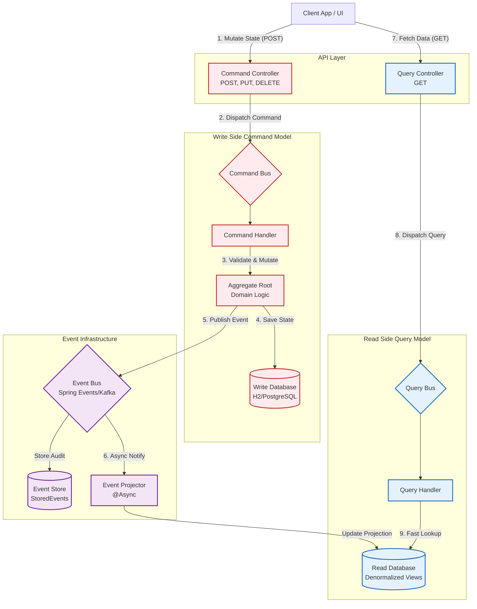

# Production-Grade CQRS Architecture

This project is a complete, production-grade implementation of the **CQRS (Command Query Responsibility Segregation)** pattern in a Spring Boot application. 

It uses an **Order Management** domain to demonstrate how to separate write operations (Commands) from read operations (Queries), utilizing Domain Events to keep the two models synchronized.

---

## 🏛️ Architecture Overview

In a traditional CRUD system, the same data model is used to update the database and read from it. As a system scales, complex business logic on the write side often conflicts with the need for fast, denormalized data on the read side.

CQRS solves this by completely splitting the application into two sides:

1. **Write Side (Command Model):** Strictly enforces business rules, maintains consistency, and protects invariants. It is highly normalized.
2. **Read Side (Query Model):** Strictly serves data to the UI. It is highly denormalized and optimized for fast lookups.

They are connected via an **Event Bus**. When the Write side mutates state, it publishes a Domain Event. The Read side listens to this event and updates its projections asynchronously.

### System Architecture Diagram



### Diagram Explanation

1.  **Client Requests:** The architecture begins at the API layer. A client issues a state-mutating request (`POST`, `PUT`, `DELETE`) to the `CommandController`, or a read request (`GET`) to the `QueryController`.
2.  **Write Flow (Red Side):** The `CommandController` dispatches a strongly-typed `Command` into the `CommandBus`. The bus locates the correct `CommandHandler`, which is responsible for loading the `Aggregate Root` (the core business object). The aggregate validates business rules and modifies its state. The new state is persisted to the `Write Database`, ensuring absolute data consistency.
3.  **Event Publishing (Purple Flow):** Upon a successful state change, the aggregate generates a `Domain Event` (e.g., `OrderCreatedEvent`). This event is sent to the `Event Bus`. For auditing and event-sourcing capabilities, it is also appended to an `Event Store`.
4.  **Synchronization:** The `Event Projector` listens to the event bus. Running completely asynchronously on a separate thread pool (`@Async`), it catches the domain event. It then translates the normalized data changes into flattened, UI-ready projections.
5.  **Read Flow (Blue Side):** The projector saves these pre-computed projections into the `Read Database`. When the `QueryController` receives a request, it dispatches a `Query` via the `QueryBus`. The `QueryHandler` accesses the `Read Database`. Because the data is already denormalized and structured exactly as the UI needs it, the read operation is exceptionally fast, requiring no complex JOINs or on-the-fly calculations.

---

## ⚙️ How It Works

### The Write Flow (State Mutation)
1. The client sends a `POST /api/orders` request with a DTO.
2. The `OrderCommandController` translates the DTO into a `CreateOrderCommand` and dispatches it via the `CommandBus`.
3. The `CreateOrderCommandHandler` loads or creates the `Order` Aggregate Root.
4. The Aggregate executes business logic, modifies its internal state, and registers an `OrderCreatedEvent`.
5. The Handler saves the Aggregate to the write database and publishes the event to the `EventBus`.

### The Synchronization Flow (Eventual Consistency)
1. The `SpringEventBus` saves the event to an append-only `StoredEvent` table (for auditing and potential event-sourcing replays) and publishes it via Spring's `ApplicationEventPublisher`.
2. The `OrderProjector` listens to the event asynchronously (`@Async`).
3. It maps the event data into a flattened format and saves it to the `order_summary_view` and `order_detail_view` tables.

### The Read Flow (Data Fetching)
1. The client sends a `GET /api/orders/{id}` request.
2. The `OrderQueryController` creates a `GetOrderByIdQuery` and dispatches it via the `QueryBus`.
3. The `GetOrderByIdQueryHandler` directly fetches the pre-computed `OrderDetailProjection` from the read database.
4. The data is returned instantly without any complex SQL `JOIN`s or on-the-fly calculations.

---

## 📂 Implementation Details

The codebase is structured into three main layers:

### 1. Infrastructure Layer (`infrastructure/`)
A reusable, domain-agnostic CQRS framework.
* **Buses:** `CommandBusImpl`, `QueryBusImpl`, `SpringEventBus` handle the dispatching of messages to the correct handlers using Spring's application context.
* **Base Classes:** `Command`, `Query`, `DomainEvent`, `AggregateRoot`.
* **Observability:** `CorrelationIdFilter` assigns a unique `X-Correlation-Id` to every request, tracking it across threads (`MDC`) and propagating it into Domain Events.
* **Async Config:** A dedicated thread pool (`cqrsEventExecutor`) handles event processing so that API response times aren't blocked by database projection updates.

### 2. Domain Layer (`domain/order/`)
The specific business logic for the Order bounded context.
* **Aggregate:** The `Order` class encapsulates all business rules (e.g., you cannot add an item to an order that is already shipped).
* **Events:** Explicit event classes (`OrderItemAddedEvent`, `OrderConfirmedEvent`) represent facts that have occurred in the system.
* **Projections:** `OrderSummaryProjection` and `OrderDetailProjection` define exactly how the data should look when requested by the frontend.

### 3. API Layer (`api/`)
* **`OrderCommandController`:** Exposes endpoints that *change* state. Returns 201/200 with an acknowledgement, not the entity itself.
* **`OrderQueryController`:** Exposes endpoints that *read* state. Returns the requested DTOs.

---

## 🚀 Running the Application

Ensure you have Java 17 installed.

```bash
# Compile the project
./mvnw clean compile

# Run the application
./mvnw spring-boot:run
```

### Try it out:
1. **Create an order (Command):**
   ```bash
   curl -X POST http://localhost:8080/api/orders \
   -H "Content-Type: application/json" \
   -d '{"customerId":"CUST-1","customerName":"Alice"}'
   ```
2. **Add an item (Command):**
   ```bash
   curl -X POST http://localhost:8080/api/orders/{orderId}/items \
   -H "Content-Type: application/json" \
   -d '{"productId":"P1","productName":"Laptop","quantity":1,"unitPrice":1000}'
   ```
3. **Query the order (Query):**
   ```bash
   curl http://localhost:8080/api/orders/{orderId}
   ```

---

## 📈 Scalability Strategy

The architecture is currently running as a single monolith with an in-memory database and an in-memory event bus. However, the interfaces (`EventBus`, `CommandBus`, repositories) were specifically designed so that scaling up requires **configuration changes, not rewrites**.

### Phase 1: Separate Databases (Read vs. Write)
Currently, both models share the same H2 database. As read traffic outpaces write traffic:
1. Configure two `DataSource` beans in Spring Boot (e.g., PostgreSQL for writes, MongoDB or Redis for reads).
2. Point the `OrderWriteRepository` to the Write DB and the `OrderSummaryReadRepository` to the Read DB.

### Phase 2: Distributed Messaging
Currently, `SpringEventBus` uses in-memory `@Async` processing. If the node crashes while processing an event, the read model falls out of sync.
1. Implement a `KafkaEventBus` or `RabbitMQEventBus` that implements the `EventBus` interface.
2. Publish Domain Events to a Kafka Topic.
3. Have the `OrderProjector` consume from that Kafka topic. This guarantees message delivery and fault tolerance.

### Phase 3: Microservices Split
If the system grows massive, the Command and Query sides can be deployed as entirely separate applications.
1. **Command Service:** Contains `infrastructure/command`, `domain/order/aggregate`, `OrderCommandController`. Publishes to Kafka.
2. **Query Service:** Contains `infrastructure/query`, `domain/order/projection`, `OrderProjector`, `OrderQueryController`. Consumes from Kafka.
You can then scale the Query Service to 50 instances while keeping the Command Service at 5 instances.

---

## 🚥 Capacity & Traffic Handling

How much traffic can a single instance of this application handle?

By default, Spring Boot with Tomcat uses a pool of **200 concurrent threads**. Because we separated the Read and Write paths, the throughput characteristics differ wildly:

### The Read Side (Queries)
* **Operation:** Single, primary-key lookup on a flattened table (no joins).
* **Latency:** ~2-5ms per request.
* **Capacity:** Because the lookup is so fast, a single Tomcat thread can process hundreds of requests per second.
* **Estimate:** A single instance (e.g., 2 vCPU, 4GB RAM) can easily handle **2,000 to 5,000 Requests Per Second (RPS)** for queries, limited mostly by network I/O and database connection pool size (HikariCP defaults to 10 connections, which you would increase).

### The Write Side (Commands)
* **Operation:** Load aggregate, execute business logic, save aggregate to DB, save event to EventStore, push event to in-memory bus.
* **Latency:** ~10-30ms per request (due to transactions and disk I/O).
* **Capacity:** Writes require database locks and sequential transaction commits.
* **Estimate:** A single instance can handle **300 to 800 Requests Per Second (RPS)** for commands.

### The Background Synchronization
* The `@Async` thread pool (`cqrsEventExecutor`) is configured to a `max-pool-size` of 8 with a queue capacity of 100.
* Under heavy write loads, if the queue fills up, the `CallerRunsPolicy` will force the HTTP thread to process the projection, causing artificial backpressure to prevent out-of-memory errors.

**Summary:** Out of the box, on standard cloud hardware, this single instance can comfortably handle **thousands of users reading data simultaneously**, while safely processing **hundreds of state-mutating transactions per second**. To handle more, you simply deploy more instances behind a Load Balancer.
